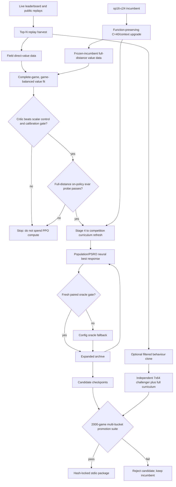

# Top-3 v2 implementation and verification handoff

Date: 2026-08-08
Target: a reproducible training and promotion pipeline capable of producing a
materially stronger generals.bot submission.
Review owner: Fable (independent verification)
Implementation owner: Codex

## Executive verdict

The old approach hit a real ceiling. It repeatedly optimized against one bot
lineage, represented a partially observed game as independent snapshots, and
trusted value/evaluation numbers that could not establish field strength. More
search over the same config space could not repair those measurement and state
representation problems.

This change set replaces that loop with:

1. top-player replay harvesting and filtered expert imitation;
2. observation-only temporal memory shared by training and deployment;
3. global plus regional context in addition to local convolutions;
4. a direct-value critic with complete-game holdouts, game-balanced metrics,
   calibration checks, and a board-blind control it must beat;
5. population/PSRO training against an expanding opponent archive;
6. a versioned, multi-bucket, 2000-game promotion suite;
7. strict configs and hash-bearing manifests for every important artifact.

There is no honest guarantee of a top-3 result. On the live
[generals.bot leaderboard](https://www.generals.bot/leaderboard), the measured
gap is over 1100 Elo. What is guaranteed by the code is narrower and useful:
bad configs fail closed, old checkpoints migrate explicitly, train/deploy
features are parity-tested, game leakage is tested, weak critics are rejected,
failed neural oracles do not enter the archive, and candidates cannot be called
promoted without passing the defined statistical, fault, runtime, and artifact
gates.

No v2 weights were trained in this workspace. Training needs the replay corpus,
the incumbent checkpoint from the VU cluster, and GPU time. The repository is
ready for that run after the independent checks below pass.

### Post-review correction: continuation is the primary arm

The first handoff draft incorrectly sent a fresh behaviour clone directly into
full-distance `learn.netoracle`. Independent review caught three load-bearing
problems: that skipped the successful distance curriculum, used the measured-bad
`critic-lr=1e-3` through an unconfigurable league subprocess, and discarded the
incumbent's 250+ PPO iterations.

This revision does **not** train the primary policy from scratch. It preserves
`sp16-c24`, function-preservingly adds the C=40/context inputs, fits a matching
critic, probes that critic on full-distance on-policy states, runs a gated
stage-4-to-competition curriculum refresh, and only then enters the population
league. `learn.league` now forwards and resume-hashes every neural optimizer
setting. Its defaults are one epoch and `critic-lr=1e-4`. The 7x64 expert clone
is an optional independent challenger, never the incumbent replacement by
construction.

### Post-review correction 2: release-blocker audit

A second independent audit found six implementation gaps before training began.
They are repaired in the replacement bundle:

1. `learn.selfplay` now owns one `TemporalMemory` per seat, supplies it to both
   policy inference and stored features, and snapshots it with counterfactual
   engine forks. The critic probe and curriculum refresh therefore see the same
   live C=40 distribution as offline value data and deployment.
2. League runoff scores are serialized from their sparse dictionary into a
   JSON-safe record. Both terminal winner paths now reach manifest creation.
3. Promotion suite schema 2 treats greedy only as a catastrophic-regression
   check (`lower_score >= 0.70`), not as a strength proxy. The +25 Elo incumbent
   SPRT remains the promotion decision.
4. Promotion moved from the already-consumed 3,000,000 seed block to the fresh
   8,000,000 block; each matchup receives a disjoint sub-block.
5. `make verify` now runs stateful memory parity automatically. It uses close
   boards and fails unless all 16 temporal planes—including enemy ownership,
   enemy army, gains, deltas, and history—actually activate.
6. Behaviour and value dataset rebuilds delete only stale `shard_*.npz` and
   `meta.json` after validating the source. A partial/shorter rebuild can no
   longer silently train on old union new.

## Live baseline

The public API behind the leaderboard was checked on 2026-08-08. It exposed 116
ranked entries and downloadable match/replay JSON. A sampled current replay had
`castles: []`, confirming that competition games strip neutral castles as the
engine analysis assumes.

| Rank | Player | Elo | Gap from H.V.Nguyen |
|---:|---|---:|---:|
| 1 | ResBot | 3212 | +1310 |
| 2 | Kubic | 3121 | +1219 |
| 3 | bca | 3034 | +1132 |
| 29 | H.V.Nguyen | 1902 | — |

H.V.Nguyen's row was 137 wins, 96 losses, 1 draw, 59% score. This is a snapshot,
not a constant; save the next run's `leaderboard.json` with the artifacts.

## What was wrong and what changed

| Ceiling cause | Why it blocked progress | Implemented correction | Proof or gate |
|---|---|---|---|
| Single-lineage evaluation | A candidate could farm v16/greedy and lose to the field. Historical local rankings repeatedly inverted ladder rankings. | `tools.evaluate` evaluates champion, sniper, hunter, greedy, expander, plus optional archive opponents. `learn.league` grows an exploit archive. | Fresh paired boards, conservative lower bounds, +25 Elo SPRT, 2000 games per bucket. |
| Stateless neural policy | Fog history, ownership transitions, stale army information, and enemy castle evidence disappeared every turn. The rich heuristic `Belief` never reached the net. | `bot.memory.TemporalMemory` and 16 temporal planes are used in inference, replay data, Python rollout, and JAX rollout. | Full-trajectory NumPy/JAX seam check; same-turn updates are idempotent. |
| Mostly local receptive field | A local move head could not directly compare global reserves, remote threats, or board regions. | Trainable valid-masked global and 3x3 regional context mixer; critic pools mean, max, and nine regional means. | NumPy/JAX forward self-check and explicit pooled-value parity test. |
| Weak/leaky value training | Position-level splits leak near-identical states. Draws were discarded. BCE and direct game value used incompatible units. Long games dominated metrics. | Direct `-1/0/+1` targets including draws; complete-game split; source-namespaced game IDs; game-balanced Huber fit and metrics; schema-2 checkpoints. | Tests prove no game crosses the split and equal raw IDs from different sources remain distinct. |
| Critic could win by reading only the clock/totals | A positive offline metric did not prove it extracted board structure or would help PPO. | Every critic is compared on the same held-out games with a fitted scalar-only control. | Gate requires target variance, decided games, at least +0.02 explained-variance gain over control, and ECE <= 0.15. Gate failure exits nonzero. |
| Mirror-only self-play | Both seats shared the same policy and blind spots, so symmetric errors were not punished. | The proven distance curriculum is retained only as a gated warm-up. `learn.netoracle` then trains paired seats against the PSRO archive distribution; `learn.league --oracle both` adds config and neural best responses. | Curriculum candidate must beat its entry weights; neural oracle must then improve on its own initialization on fresh paired boards before archive admission. Effective opponent count must be >= 2. |
| Low-quality imitation mixture | Cloning every replay reproduced our own habits and weak opponents. | `analysis.official harvest --top`; `learn.dataset --leaderboard --top/--min-elo` filters seats to the live expert set. | Dataset metadata records included/excluded players and a source file-set hash. |
| Fragile checkpoint evolution | Changing channels or topology could silently truncate, mislabel, or fail late. | Architecture records now include depth, width, residual wiring, context, and input channels. C=24 stems zero-pad to C=40 function-preservingly. `tools.grow --context` adds a zero-initialized context path. | Legacy migration function-preservation test; topology validation before workers start. |
| Config drift | Missing and misspelled keys silently fell back to defaults, so a run was not necessarily the config its filename claimed. | Config schema v1, fully materialized JSON, strict unknown/missing/type rejection, explicit legacy migration. | `python -m tools.migrate_configs --check configs/*.json`. |
| Unreproducible artifacts | Filenames did not identify source, weights, runtime, dirty tree, or data. | `tools.manifest` records SHA-256s, source-tree hash, Git state, command, runtime versions, resolved configs, and input artifacts. Training/evaluation write manifests automatically. | Reviewer compares manifests and checkpoint hashes before promotion/package. |
| Unsafe speculative search | Value-guided action search could amplify an uncalibrated critic or breach the move budget. | `bot.policy.search.SearchPolicy` is opt-in, top-K only, and refuses a critic without a passing schema-2 sidecar. | It is not the shipped default and must earn a separate runtime and arena result before use. |
| Packaging ambiguity | `bot/weights.npz` survives builds, so a plausible ZIP could contain an old net. | Package prints the exact SHA-256; `--expect` makes a mismatch fatal; package smoke plays the actual `run.sh` over stdio. | Final package command below requires the intended digest. |

## New data and model flow



## Exact training sequence

Do not overwrite the incumbent. Copy its exact `.npz` from the cluster first,
record its SHA-256, and keep it as `runs/top3-v2/incumbent.npz`. The clean
repository intentionally contains no neural checkpoint, and the old ZIPs in
`dist/` contain no weights.

### 0. Preflight

On a CPU verification machine:

```bash
make setup-cpu
make verify
.venv/bin/python -m tools.grow --selfcheck
.venv/bin/python -m tools.valueselfplay --selfcheck
.venv/bin/python -m tools.calibtemp --selfcheck
.venv/bin/python -m tools.vprobe --selfcheck
```

On the GPU node, follow `docs/CLUSTER.md` and confirm that JAX reports the CUDA
device. Do not replace the cluster's working CUDA JAX with the CPU extra.

### 1. Harvest the current expert field

Run this from a machine whose IP the site accepts, at the polite default delay:

```bash
.venv/bin/python -m analysis.official harvest \
  --top 10 \
  --out /local/data/vng205/top3-v2/field-current \
  --limit 200 \
  --delay 1
```

Keep `/local/data/vng205/top3-v2/field-current/leaderboard.json`. Re-running is safe:
existing replay IDs are skipped and unavailable IDs are recorded.

### 2. Build expert policy and field-value shards

```bash
/local/data/vng205/venv/bin/python -m learn.dataset \
  /local/data/vng205/top3-v2/field-current \
  --out /local/data/vng205/top3-v2/bc \
  --leaderboard /local/data/vng205/top3-v2/field-current/leaderboard.json \
  --top 10 \
  --workers 60
```

```bash
/local/data/vng205/venv/bin/python -m learn.valuedata \
  /local/data/vng205/top3-v2/field-current \
  --out /local/data/vng205/top3-v2/value-field \
  --stride 4 \
  --drop-last 25 \
  --workers 60
```

Before continuing, inspect both `meta.json` files. The policy data must list
only the intended expert seats; neither metadata file may report zero rows.

### 3. Preserve and materialize the incumbent

`sp16-c24.npz` is data, not an executable. Copy it; do not type its path as a
shell command and do not overwrite the source file:

```bash
mkdir -p runs/top3-v2
cp runs/nn/sp16-c24.npz runs/top3-v2/incumbent.npz
sha256sum runs/top3-v2/incumbent.npz | tee runs/top3-v2/incumbent.sha256
```

Inspect the checkpoint and fail immediately if it predates the nine-action move
head used by this build:

```bash
$PY -m tools.grow --show runs/top3-v2/incumbent.npz
$PY - <<'PY'
import numpy as np
from bot import features
from bot.policy.net import Net
p = "runs/top3-v2/incumbent.npz"
z = np.load(p)
assert z["head_w"].shape[0] == features.PER_CELL, (z["head_w"].shape, features.PER_CELL)
n = Net(p)
print("load OK", n.arch, "head", z["head_w"].shape, "stem", z["conv0_w"].shape)
PY
```

The documented incumbent is plain 8x32. Materialize its C=40 stem and zero
context path explicitly; this starts as the same function:

```bash
$PY -m tools.grow \
  --net runs/top3-v2/incumbent.npz \
  --out runs/top3-v2/incumbent-c40-context.npz \
  --layers 8 \
  --channels 32 \
  --context
$PY -m tools.grow \
  --show runs/top3-v2/incumbent-c40-context.npz \
  --against runs/top3-v2/incumbent.npz
```

Stop if `--show` reports an architecture other than plain 8x32; use the reported
depth and width rather than coercing an unknown checkpoint into these flags.

### 4. Fit and probe an incumbent-matched critic

Generate full-competition states from the frozen upgraded incumbent. `--dmax`
is omitted intentionally: the competition generator is distance 17 and above,
not only 17-24.

```bash
$PY -m tools.valueselfplay \
  --weights runs/top3-v2/incumbent-c40-context.npz \
  --out /local/data/vng205/top3-v2/value-incumbent \
  --games 3000 \
  --competition-distance \
  --stride 4 \
  --drop-last 25 \
  --workers 60
```

Fit field and on-policy sources together using the incumbent's architecture:

```bash
$PY -m learn.valuetrain \
  --data /local/data/vng205/top3-v2/value-field \
  --data /local/data/vng205/top3-v2/value-incumbent \
  --out runs/top3-v2/incumbent-value.npz \
  --layers 8 \
  --channels 32 \
  --context \
  --epochs 12 \
  --batch 512 \
  --lr 5e-4 \
  --val-frac 0.05 \
  --seed 0
```

The command exits nonzero if the complete-game critic gate fails. Never bypass
that failure. Then run the cheap full-distance on-policy transfer probe before
an overnight job:

```bash
$PY -m learn.selfplay \
  --init runs/top3-v2/incumbent-c40-context.npz \
  --init-critic runs/top3-v2/incumbent-value.npz \
  --out runs/top3-v2/critic-transfer-probe.npz \
  --probe 20 \
  --start-stage 5 \
  --stage-replay 0 \
  --games 256 \
  --epochs 1 \
  --critic-lr 1e-4 \
  --warm-evar 0.10 \
  --opp ours:configs/v16.json,clone:runs/top3-v2/incumbent.npz \
  --workers 60 \
  --seed 0
```

Proceed only if the log shows held-out/on-policy `evar >= 0.10` and non-degenerate
W/D/L. The probe output is not a candidate and must not enter the league. This
test removes the old plan's untested assumption that an offline critic will
automatically transfer to full-distance PPO.

### 5. Gated curriculum refresh, then population league

The incumbent already cleared the earlier distance curriculum. Refresh only
the two competition-relevant bands: stage 4 is 17-24 and stage 5 is the exact
17+ competition distribution. Historical evidence says replaying short stages
can erase castle behaviour, so it is explicitly disabled.

```bash
$PY -m learn.selfplay \
  --init runs/top3-v2/incumbent-c40-context.npz \
  --init-critic runs/top3-v2/incumbent-value.npz \
  --out runs/top3-v2/incumbent-refresh.npz \
  --iters 300 \
  --start-stage 4 \
  --stage-cap 120 \
  --stage-replay 0 \
  --games 256 \
  --epochs 1 \
  --critic-lr 1e-4 \
  --warm-evar 0.10 \
  --opp ours:configs/v16.json,hunter:3,clone:runs/top3-v2/incumbent.npz \
  --workers 60 \
  --seed 0
```

Use `incumbent-refresh.npz` only if its paired final gate says `accepted: true`.
When accepted, pair it with `incumbent-refresh.critic.npz`, which is selected
on the same competition evaluation as that exact policy. If rejected, keep
`incumbent-c40-context.npz` with `incumbent-value.npz`. Never mix those pairs.
Set the two shell variables below to the accepted pair:

```bash
export TOP3_POLICY=runs/top3-v2/incumbent-c40-context.npz
export TOP3_CRITIC=runs/top3-v2/incumbent-value.npz
# Replace both together with incumbent-refresh.npz and
# incumbent-refresh.critic.npz only after its gate passes.
```

Now run population best response. The incumbent is both the neural starting
point and an initial archive member; the league no longer starts from the fresh
BC clone or silently discards the incumbent's PPO history:

```bash
$PY -m learn.league \
  --dir runs/top3-v2/league \
  --out runs/top3-v2/league/winner.json \
  --oracle both \
  --nn-init "$TOP3_POLICY" \
  --nn-init-critic "$TOP3_CRITIC" \
  --seeds hunter:1,hunter:3,greedy,expander,ours:configs/v16.json,ours:configs/v12.json,clone:runs/top3-v2/incumbent.npz \
  --iters 6 \
  --gens 4 \
  --pop 24 \
  --elite 5 \
  --games 48 \
  --pair-games 48 \
  --runoff-games 96 \
  --nn-iters 200 \
  --nn-games 256 \
  --nn-epochs 1 \
  --nn-minibatch 4096 \
  --nn-lr 1e-4 \
  --nn-critic-lr 1e-4 \
  --nn-warm-evar 0.10 \
  --nn-sigma-floor 0.25 \
  --workers 60 \
  --seed 0
```

Use generated boards. At startup, `effective opponents` must be at least 2.0.
The neural subprocess command printed by the league must visibly contain the
five `--nn-*` optimizer values above. These values are also in the checkpoint's
resume identity, so changing one requires a new `--dir`.

Each failed neural oracle falls back to the config oracle and does not enter the
archive. Promotion-test the runoff winner and up to two strong, diverse accepted
checkpoints; the league is a search instrument, not the significance test.

### Optional independent challenger: mostly from scratch

Only after the incumbent arm is running should the expert 7x64 residual arm be
trained. It needs its own behaviour clone, its own 7x64 critic, and the complete
stage-0-to-5 curriculum. It enters the archive only after the same promotion
suite beats `incumbent.npz`. A critic or resume file from the 8x32 arm is never
loadable into it. This arm explores capacity; it is not the recovery plan if the
primary arm fails.

```bash
$PY -m learn.train \
  --data /local/data/vng205/top3-v2/bc \
  --out runs/top3-v2/challenger-clone.npz \
  --layers 7 --channels 64 --residual --context --augment \
  --epochs 20 --patience 3 --batch 512 --seed 1

$PY -m tools.valueselfplay \
  --weights runs/top3-v2/challenger-clone.npz \
  --out /local/data/vng205/top3-v2/value-challenger-short \
  --games 3000 --dmin 2 --dmax 6 --stride 4 --drop-last 25 --workers 60

$PY -m learn.valuetrain \
  --data /local/data/vng205/top3-v2/value-field \
  --data /local/data/vng205/top3-v2/value-challenger-short \
  --out runs/top3-v2/challenger-value.npz \
  --layers 7 --channels 64 --residual --context \
  --epochs 12 --batch 512 --lr 5e-4 --val-frac 0.05 --seed 1

$PY -m learn.selfplay \
  --init runs/top3-v2/challenger-clone.npz \
  --init-critic runs/top3-v2/challenger-value.npz \
  --out runs/top3-v2/challenger-curriculum.npz \
  --iters 1200 --start-stage 0 --stage-cap 200 --stage-replay 0 \
  --games 256 --epochs 1 --critic-lr 1e-4 --warm-evar 0.10 \
  --opp ours:configs/v16.json,hunter:3,clone:runs/top3-v2/incumbent.npz \
  --workers 60 --seed 1
```

Do not run this concurrently with the primary JAX job on one L4. If its final
gate rejects it, retain the files as evidence but do not add it to the league.

### 6. Promotion

First run a two-game operational smoke; failure is expected statistically but
construction, manifests, results, timing, and fault accounting must work:

```bash
.venv/bin/python -m tools.evaluate \
  --candidate runs/top3-v2/league/winner.npz \
  --reference runs/top3-v2/incumbent.npz \
  --out runs/top3-v2/eval-smoke \
  --games 2 \
  --workers 1
```

Then run the unmodified suite. It uses 2000 fresh paired games for every bucket
and the exact 1200-turn limit:

```bash
/local/data/vng205/venv/bin/python -m tools.evaluate \
  --candidate runs/top3-v2/league/winner.npz \
  --reference runs/top3-v2/incumbent.npz \
  --out runs/top3-v2/eval-winner \
  --workers 60
```

Add accepted archive networks as extra opponents when practical:

```bash
/local/data/vng205/venv/bin/python -m tools.evaluate \
  --candidate runs/top3-v2/league/winner.npz \
  --reference runs/top3-v2/incumbent.npz \
  --extra-opponent clone:runs/top3-v2/league/nn/oracle-nn-0.npz \
  --extra-opponent clone:runs/top3-v2/clone.npz \
  --out runs/top3-v2/eval-winner-expanded \
  --workers 60
```

A candidate is promoted only when `summary.json` says all of the following:

- champion bucket lower score >= 0.5 and SPRT accepts H1 at +25 Elo;
- sniper lower score >= 0.45;
- hunter lower score >= 0.90;
- greedy lower score >= 0.70. This is a catastrophic-regression floor only;
  greedy margin is not a strength proxy and must not veto a candidate that
  proves improvement against the incumbent;
- expander lower score >= 0.90;
- every extra opponent has a non-negative lower confidence result;
- candidate faults are zero;
- maximum candidate move time is <= 125 ms.

Do not average a failed bucket into a passing mean. `robust_lower_score` ranks
only candidates that already pass every floor.

### 7. Package exactly the promoted weights

Copy only the passing checkpoint, calculate its digest, and require that digest
at build time:

```bash
cp runs/top3-v2/league/winner.npz bot/weights.npz
sha256sum bot/weights.npz
.venv/bin/python -m tools.package \
  --name generals-bot-top3-v2 \
  --config configs/v18.json \
  --expect REPLACE_WITH_SHA256 \
  --test 4
```

Archive together:

- the ZIP;
- candidate `.npz`, `.json`, and `.manifest.json`;
- evaluation `summary.json`, `results.jsonl`, and `manifest.json`;
- value model and sidecar;
- replay/dataset metadata;
- leaderboard snapshot;
- the exact Git commit or dirty source-tree manifest.

The first ladder upload is a canary, not proof of top-3 strength. Check faults,
runtime, and gross strategic regressions immediately. Do not infer Elo from a
small ladder sample; retain the incumbent until the field result has enough
games to be interpretable.

## Promotion gates in order

| Stage | Pass condition | Failure action |
|---|---|---|
| Source/config | Strict config check, clean compile, all tests, engine and non-vacuous 16-plane temporal seam parity | Stop and fix code. |
| Data | Nonzero rows; intended expert set; source hashes stored; games and draws present | Rebuild shards. |
| BC | Finite training; no patience/NaN failure; artifact manifest present | Fix fit/data; no strength claim. |
| Critic | Complete-game holdout; target variance > 0.05; decided fraction > 0.1; evar gain over scalar >= 0.02; ECE <= 0.15 | Do not launch PPO. |
| Population | Effective opponents >= 2; neural oracle fresh gate accepted; no seed/pool overlap warning | Increase diversity or reject oracle. |
| Promotion | Every matchup floor, +25 Elo champion SPRT, zero faults, <=125 ms | Keep incumbent. |
| Artifact | Expected weight hash matches packaged hash; stdio smoke passes | Do not upload. |
| Ladder | Canary has no faults or catastrophic failure; sufficient field sample before an Elo conclusion | Roll back or continue measuring. |

## Fable verification checklist

Fable should review and rerun, not merely read this summary.

### Code invariants

- Compare `bot/memory.py` with `learn/rlenv.py`: first-frame terrain,
  visibility, same-turn idempotence, last-seen state, deltas, and enemy history
  must remain semantically identical.
- Compare `bot/policy/net.py` with `learn/train.py`: trunk wiring, context mixer,
  valid masking, move layout, residual ordering, and checkpoint architecture.
- Compare `bot.policy.net.ValueNet._pooled` with `learn.valuetrain.pooled`.
- Verify `learn/valuetrain.py` never puts one canonical game in train and
  validation, including two data sources with the same raw numeric ID.
- Verify schema-2 critic sidecars are mandatory for `learn.selfplay`,
  `learn.netoracle`, and `bot.policy.search`.
- Verify `learn.netoracle` receives `--init-critic` through the
  `learn.league` subprocess command and hashes it in its manifest.
- Verify promotion seeds are outside training/evaluation-selection ranges and
  every board is played from both seats.
- Verify `ship:` still matches `bot/main.py` composition: network, configured
  TTA, then guard.
- Verify package digest enforcement uses the same `bot/weights.npz` copied into
  the ZIP.

### Commands to rerun

```bash
git diff --check
make verify
.venv/bin/python -m tools.migrate_configs --check configs/*.json
.venv/bin/python -m learn.train --selfcheck
.venv/bin/python -m learn.selfplay --selfcheck
.venv/bin/python -m learn.netoracle --selfcheck
.venv/bin/python -m tools.valueselfplay --selfcheck
.venv/bin/python -m tools.calibtemp --selfcheck
.venv/bin/python -m tools.vprobe --selfcheck
.venv/bin/python -m bot.policy.ensemble
```

Create a tiny synthetic two-source value set and confirm a failed critic gate
exits nonzero. Run a two-game evaluation smoke and a two-game stdio package
smoke. Inspect the resulting manifests for source-tree hash, Git dirtiness,
command, runtime versions, and artifact SHA-256s.

### Do not approve if

- any parity test is skipped on the machine used for sign-off;
- the incumbent checkpoint/hash is unknown;
- critic validation rows overlap training games;
- value targets contain anything outside `-1/0/+1`;
- the population trainer reports fewer than two effective opponents;
- a failed oracle appears in `league.json`;
- the promotion run uses `--games` to reduce the default;
- any bucket fails but an aggregate is presented as a pass;
- the ZIP's printed weight hash differs from the promoted checkpoint;
- search is enabled without its critic gate and an independent runtime/promotion
  result.

## Verification completed in this workspace

At handoff time the following passed locally with Python 3.12, NumPy, and CPU
JAX:

- Python compilation for `bot`, `learn`, `tools`, `analysis`, `arena`, `tests`,
  and `sim`;
- all 33 unit/integration tests;
- 3840-step engine/training seam across nine board shapes;
- 1374 compared observation frames, maximum stateless encoder difference
  `1.2e-07`;
- 1668-frame stateful temporal parity, maximum difference `1.2e-07`, with every
  one of the 16 temporal planes activated;
- legal build coverage on 661 frames, 192 executed builds, 193 distinct cells,
  and costs spanning 35 through 109;
- `train`, `selfplay`, `netoracle`, `vecroll`, `grow`, `valueselfplay`,
  `calibtemp`, `vprobe`, and ensemble self-checks;
- strict migration check for all 12 config files;
- promotion smoke wrote results, summary, and manifest and correctly rejected an
  unproven candidate;
- package smoke built a 21-file ZIP, included `bot/memory.py`, played two games
  through the real stdio protocol, won both against greedy, recorded zero
  faults, and had a 64.5 ms slowest move. It correctly reported `net: NONE`,
  because this clean workspace contains no checkpoint.

These prove implementation consistency, not Elo improvement. GPU optimization,
the full expert corpus, the overnight population run, the 2000-game promotion
suite, and the ladder canary remain execution tasks.

## Files changed

Core state and inference:

- `bot/memory.py`
- `bot/features.py`
- `bot/policy/net.py`
- `bot/policy/guard.py`
- `bot/policy/ensemble.py`
- `bot/policy/search.py`
- `arena/agents.py`

Training and data:

- `learn/rlenv.py`
- `learn/vecroll.py`
- `learn/dataset.py`
- `learn/valuedata.py`
- `learn/valuetrain.py`
- `learn/train.py`
- `learn/selfplay.py`
- `learn/netoracle.py`
- `learn/league.py`
- `tools/valueselfplay.py`
- `tools/calibtemp.py`
- `tools/grow.py`
- `tools/cfprobe.py`
- `tools/vprobe.py`

Evaluation, reproducibility, and operations:

- `tools/evaluate.py`
- `evaluation/top3-v2.json`
- `tools/manifest.py`
- `tools/migrate_configs.py`
- `analysis/official.py`
- `tools/verify_engine.py`
- `tools/package.py` (existing digest enforcement verified and documented)
- `bot/config.py`
- all JSON configs under `configs/`
- `pyproject.toml`
- `Makefile`
- `tests/test_all.py`
- `README.md`, `CLAUDE.md`, `docs/CLUSTER.md`, and `docs/STATE.md`

## Known limitations

- Temporal memory is deterministic feature state, not a recurrent network. This
  is easier to verify and deploy, but less expressive than a trained recurrent
  belief model.
- The context mixer is a cheap global/3x3 summary path, not attention or a
  multiscale U-Net. It is deliberately sized for the one-core move budget.
- Official replay actions must be reconstructed; the behaviour dataset keeps
  only simulator-confirmed actions and reports its recovery rate.
- The public API can throttle or refuse old replay IDs. The harvester backs off,
  records refusals, and does not retry around them.
- The critic gate proves held-out board signal over a scalar control; it does not
  prove that a critic will remain on-distribution after a policy changes.
- The population oracle is still PPO with a finite archive. Archive diversity
  and effective opponent count must be monitored, not assumed.
- `SearchPolicy` uses a visible one-action approximation and is intentionally
  off by default. It is research scaffolding, not part of the v2 submission.
- No local benchmark can prove top-3 ladder strength because the top bots are not
  runnable opponents. Expert replays improve the training distribution, while
  the final ladder remains the external test.

## Final decision rule

Start the expensive training only after Fable signs off the code/data gates.
Ship only a checkpoint that passes the unchanged promotion suite and exact
artifact hash check. Call it an improvement only after that offline result and a
nontrivial ladder sample agree. Call it top-3 only when the live leaderboard
actually says so.
